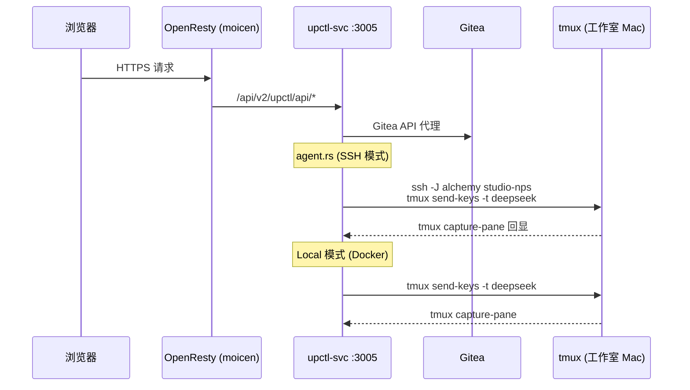

# 部署架构

```mermaid
graph TB
    subgraph Internet [互联网]
        USER[用户浏览器]
        DEEPSEEK[DeepSeek API<br/>api.deepseek.com]
        GITHUB[GitHub / crates.io]
    end

    subgraph Cloud_Moicen [云主机 · 测试服<br/>moicen.com · 101.43.244.164]
        direction TB
        OpenResty[OpenResty<br/>443 / 80<br/>反向代理 + 静态文件]
        htytch[htyteacher<br/>teacher.moicen.com<br/>Vue 3 SPA]
        htyts[htyts-web<br/>ts.moicen.com<br/>Vue 3 SPA]
        upctl_web[upctl-web<br/>ticket.moicen.com<br/>Vue 3 SPA]
        authcore_web[authcoreadmin<br/>admin.moicen.com<br/>Vue 3 SPA]

        HUKE_BACK[huike-back<br/>Rust Axum<br/>htyuc:3000 htyws:3001 htykc:3002 htyts:3003 htyproc:3004]
        AUTH_CORE[AuthCore<br/>Rust<br/>身份认证 / unionid 登录]
        upctl_svc[upctl-svc<br/>Rust Axum :3005<br/>工单 API + Gitea 代理]
        GITEA[Gitea<br/>3000 / 3001<br/>代码托管 + CI + 工单追踪]
        PG[PostgreSQL :5432<br/>huike + gitea]
        REDIS[Redis :6379]
        NPS_SRV[NPS Server<br/>:8024 穿透桥梁]

        OpenResty --> htytch
        OpenResty --> htyts
        OpenResty --> upctl_web
        OpenResty --> authcore_web
        OpenResty --> HUKE_BACK
        HUKE_BACK --> AUTH_CORE
        HUKE_BACK --> PG
        HUKE_BACK --> REDIS
        upctl_svc --> GITEA
        GITEA --> PG
    end

    subgraph Cloud_Alchemy [云主机 · 正式服<br/>alchemy-studio.cn · 152.136.103.69]
        direction TB
        NPS_CLI_ALC[NPS Client<br/>内网穿透节点]
        V2Ray[V2Ray<br/>SOCKS5 :1080<br/>编译 / 网络出口]
        OpenResty_Prod[OpenResty<br/>443 / 80<br/>生产环境]
    end

    subgraph Studio_Mac [工作室 Mac · 192.168.0.116]
        direction TB
        NPS_CLI_MAC[NPS Client<br/>反向隧道 :10002 → SSH]

        subgraph Tmux [tmux 会话]
            DEEPSEEK_TUI["deepseek-tui<br/>DeepSeek Agent<br/>(YOLO 模式)"]
            loop_watchdog[loop_watchdog.sh<br/>cron · 每 5 分钟<br/>拉取 approved 工单]
            work[work 会话<br/>手动运维]
        end

        subgraph Dev [本地开发]
            PLAYWRIGHT[Playwright E2E<br/>huike-e2e-moicen]
            CODE[VS Code / Cursor<br/>huiwing-migration]
        end

        SSH_TUNNEL[SSH 隧道<br/>→ alchemy V2Ray<br/>127.0.0.1:1080]
    end

    %% ── Agent.rs 架构 ──
    subgraph AgentBackend [upctl-svc agent.rs · 两种后端模式]
        LABEL_LOCAL[Local 模式<br/>Docker 环境直连 tmux]
        LABEL_SSH[SSH 模式<br/>经 NPS 隧道 → studio Mac tmux]
    end

    %% ── 数据流连线 ──

    %% NPS 穿透
    NPS_SRV -.->|NPS 协议 :10002| NPS_CLI_MAC
    NPS_SRV -.->|NPS 协议| NPS_CLI_ALC

    %% SSH 隧道：moicen → alchemy → studio
    NPS_SRV -->|ssh studio-nps<br/>ProxyJump alchemy| NPS_CLI_ALC
    NPS_CLI_ALC -->|Jump| NPS_CLI_MAC
    NPS_CLI_MAC -->|端口 10002| Tmux

    %% Agent.rs 在 SSH 模式下如何连到工作室 Mac
    upctl_svc -.->|agent.rs SSH 模式<br/>AGENT_BACKEND=ssh<br/>TMUX_SSH_HOST=studio-nps<br/>TMUX_SSH_JUMP=alchemy| Tmux

    %% Agent.rs 在 Local 模式下
    upctl_svc -.->|agent.rs Local 模式<br/>Docker 内直连| LABEL_LOCAL

    %% Watchdog → upctl-svc → Gitea
    loop_watchdog -.->|curl Gitea API| GITEA

    %% 出网代理
    upctl_svc -.->|SSH 隧道 SOCKS5 :1080| SSH_TUNNEL
    SSH_TUNNEL -.->|代理| V2Ray
    V2Ray --> GITHUB

    %% DeepSeek API
    upctl_svc -.->|deepseek API 调用| DEEPSEEK

    %% 用户访问
    USER -->|HTTPS| OpenResty

    %% 本地开发连线
    CODE -->|git push| GITEA
    PLAYWRIGHT -->|测试| OpenResty

    %% 样式（透明背景）
    classDef cloud fill:#e8f0fe,stroke:#1967d2,color:#1a1a2e;
    classDef mac fill:#fce8e6,stroke:#d93025,color:#1a1a2e;
    classDef web fill:#e6f4ea,stroke:#137333,color:#1a1a2e;
    classDef agent fill:#f3e8fd,stroke:#7c3aed,color:#1a1a2e,stroke-dasharray: 5 5;
    class Cloud_Moicen,Cloud_Alchemy cloud;
    class Studio_Mac mac;
    class htytch,htyts,upctl_web,authcore_web web;
    class AgentBackend agent;
```



## 架构说明

### 结点角色

| 结点 | 角色 | 公网 IP |
|------|------|---------|
| **moicen.com** | 测试服 — 运行所有业务服务、Gitea、NPS Server | `101.43.244.164` |
| **alchemy-studio.cn** | 正式服 — 生产环境 + V2Ray 出网代理 + NPS 穿透节点 | `152.136.103.69` |
| **工作室 Mac** | 开发机 — 本地编码、Playwright E2E、DeepSeek TUI Agent | 内网 `192.168.0.116` |

### NPS 内网穿透

NPS（内网穿透服务）在本架构中承担桥梁角色：

- **NPS Server** 运行在 **moicen**（`:8024`），作为注册与转发中心
- **NPS Client** 运行在 **alchemy** 和 **工作室 Mac**，各自注册隧道
- 工作室 Mac 通过 NPS 暴露 `127.0.0.1:10002`（SSH），使得云主机可以反向 SSH 到开发机
- alchemy 可以直接 `ssh studio-nps` 连到工作室 Mac
- moicen 通过 `ProxyJump alchemy` 两跳到达工作室 Mac

### `agent.rs` 的作用

`upctl-svc/src/agent.rs` 是 **upctl-svc** 中负责与 tmux 会话交互的模块，定义了 `AgentBackend` 枚举，支持两种操作模式：

#### Local 模式（`AGENT_BACKEND=local`）

- 在 **upctl-compose Docker 环境**中，直接调用本地 `tmux` 命令
- 用于单机部署场景，agent 与 tmux 在同一宿主机

#### SSH 模式（`AGENT_BACKEND=ssh`）

- 通过 SSH 经 NPS 隧道连接到 **工作室 Mac** 的 tmux 会话
- 环境变量：
  - `TMUX_SSH_HOST=studio-nps` — NPS 反向隧道暴露的 SSH 目标
  - `TMUX_SSH_JUMP=alchemy` — 两跳场景下的跳板机
  - `TMUX_SSH_OPTS=StrictHostKeyChecking=no,ConnectTimeout=5`
- 典型调用链路：
  ```
  upctl-svc → ssh studio-nps → NPS 隧道 → 工作室 Mac tmux
  ```
  （两跳时：`ssh -J alchemy studio-nps`）

#### Agent 功能

agent.rs 提供以下 tmux 操作抽象：

| 方法 | 功能 |
|------|------|
| `send_keys()` | 向 tmux 会话发送按键（支持 literal/非 literal 模式） |
| `send_prompt()` | 两步提交：输入提示文字 → 回车发送 |
| `capture_pane()` | 捕获 tmux 面板最近 200 行输出 |
| `has_session()` | 检查 tmux 会话是否存在 |
| `ensure_session()` | 确保 tmux 会话存在（仅 Local 模式支持自动创建） |

对于 SSH 模式下的长文本发送，agent.rs 采用 **临时文件 + tmux paste-buffer** 策略避免 SSH 命令行长度限制：

```rust
// 伪代码流程
1. 生成临时文件路径 /tmp/tmux_send_{uuid}
2. 通过 stdin cat > 临时文件（避免命令行长度限制）
3. tmux load-buffer → paste-buffer 粘贴到目标会话
4. rm -f 清理临时文件
```

### 请求流



### 出网代理链路

moicen 上的 Rust 编译、Git 操作等需要代理出网：

```
moicen → SSH 隧道 :1080 → alchemy V2Ray SOCKS5 :1080 → 外网
```

通过 `huiwing-tunnel-alchemy` 脚本一键建立：

```bash
ssh -N -L 127.0.0.1:1080:127.0.0.1:1080 weli@alchemy-studio.cn
```

### 相关文档

| 主题 | 文档路径 |
|------|----------|
| 架构总览 | `ARCHITECTURE.md` |
| AI Agent 工单处理 | `ai-agent/poll_worker.py` + `deepseek_agent.py` |
| agent.rs 源码 | `upctl-svc/src/agent.rs` |
| NPS 穿透文档 | `plan_skills/moicen/` |
| V2Ray 隧道 | `plan_skills/moicen/moicen-tunnel-alchemy-v2ray-1080-proxy.md` |
| 看门狗架构 | `plan_skills/sanctum/loop_watchdog_architecture.md` |
| 部署工作流 | `plan_skills/workshop/deploy_workflow.md` |
